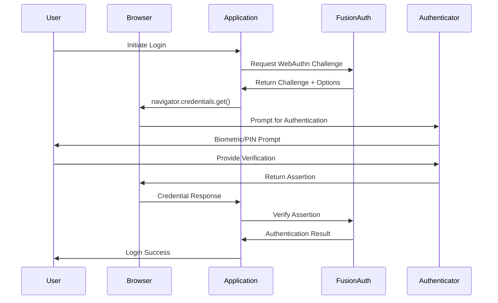

# WebAuthn/Passkey Implementation Best Practices with FusionAuth

> **Implementation Complexity**: Medium  
> **Security Level**: Maximum  
> **Browser Support**: 95%+ modern browsers  
> **Recommended for**: High-security applications, passwordless authentication

## Executive Summary

This guide provides comprehensive best practices for implementing WebAuthn/Passkeys with FusionAuth, covering security considerations, UX patterns, and enterprise deployment strategies. Passkeys represent the future of authentication, offering phishing-resistant, passwordless security.

## Understanding WebAuthn & Passkeys

### Key Concepts

- **WebAuthn**: W3C standard for web authentication using public key cryptography
- **Passkeys**: Consumer-friendly implementation of WebAuthn credentials
- **FIDO2**: Broader standard encompassing WebAuthn and CTAP protocols
- **Authenticators**: Hardware or software that creates and manages credentials

### FusionAuth WebAuthn Support

FusionAuth provides comprehensive WebAuthn support including:
- Passkey registration and authentication workflows
- Multi-device credential management
- Enterprise policy enforcement
- Fallback authentication methods
- Advanced security features (user verification, attestation)

## Architecture & Security Model

### WebAuthn Flow Overview



### Security Benefits

1. **Phishing Resistance**: Origin binding prevents credential theft
2. **No Shared Secrets**: Private keys never leave the device
3. **Replay Protection**: Each authentication includes unique challenge
4. **Attestation**: Cryptographic proof of authenticator authenticity
5. **User Verification**: Built-in biometric or PIN verification

## Implementation Guide

### 1. FusionAuth Configuration

#### WebAuthn Settings

```json
{
  "webAuthnConfiguration": {
    "enabled": true,
    "relyingPartyId": "example.com",
    "relyingPartyName": "Example Corp",
    "requireUserVerification": true,
    "userVerificationRequirement": "required",
    "authenticatorAttachment": "platform",
    "residentKeyRequirement": "required",
    "attestationConveyancePreference": "direct"
  }
}
```

#### Application Configuration

```javascript
// FusionAuth Application Setup
const applicationConfig = {
  name: "Passkey Demo App",
  webAuthnConfiguration: {
    enabled: true,
    workflow: "passwordlessOrPassword", // Options: passwordless, mfa, passwordlessOrPassword
    requireUserVerification: true,
    userVerificationRequirement: "required"
  },
  loginConfiguration: {
    allowTokenRefresh: true,
    generateRefreshTokens: true
  }
};
```

### 2. Frontend Implementation

#### Registration Flow

```javascript
// passkey-registration.js
class PasskeyRegistration {
  constructor(fusionAuthClient) {
    this.client = fusionAuthClient;
  }

  async registerPasskey(userId, displayName) {
    try {
      // Step 1: Start WebAuthn registration
      const startResponse = await this.client.startWebAuthnRegistration(userId);
      
      if (!startResponse.wasSuccessful()) {
        throw new Error(`Registration start failed: ${startResponse.errorResponse}`);
      }

      const options = startResponse.successResponse.options;
      
      // Step 2: Browser WebAuthn API call
      const credential = await navigator.credentials.create({
        publicKey: {
          ...options,
          user: {
            ...options.user,
            displayName: displayName
          },
          // Enhanced security options
          authenticatorSelection: {
            authenticatorAttachment: "platform", // Prefer built-in authenticators
            userVerification: "required",
            residentKey: "required"
          },
          attestation: "direct" // Get device attestation
        }
      });

      // Step 3: Complete registration
      const completeResponse = await this.client.completeWebAuthnRegistration({
        credential: {
          id: credential.id,
          rawId: this.arrayBufferToBase64(credential.rawId),
          response: {
            clientDataJSON: this.arrayBufferToBase64(credential.response.clientDataJSON),
            attestationObject: this.arrayBufferToBase64(credential.response.attestationObject)
          },
          type: credential.type
        }
      });

      if (completeResponse.wasSuccessful()) {
        return {
          success: true,
          credentialId: completeResponse.successResponse.credentialId,
          displayName: displayName
        };
      } else {
        throw new Error(`Registration failed: ${completeResponse.errorResponse}`);
      }

    } catch (error) {
      console.error('Passkey registration failed:', error);
      return { success: false, error: error.message };
    }
  }

  arrayBufferToBase64(buffer) {
    const bytes = new Uint8Array(buffer);
    let binary = '';
    for (let i = 0; i < bytes.byteLength; i++) {
      binary += String.fromCharCode(bytes[i]);
    }
    return btoa(binary);
  }
}
```

#### Authentication Flow

```javascript
// passkey-authentication.js
class PasskeyAuth {
  constructor(fusionAuthClient) {
    this.client = fusionAuthClient;
  }

  async authenticateWithPasskey(loginId) {
    try {
      // Step 1: Start WebAuthn authentication
      const startResponse = await this.client.startWebAuthnLogin(loginId);
      
      if (!startResponse.wasSuccessful()) {
        throw new Error(`Authentication start failed: ${startResponse.errorResponse}`);
      }

      const options = startResponse.successResponse.options;

      // Step 2: Browser WebAuthn API call
      const assertion = await navigator.credentials.get({
        publicKey: {
          ...options,
          userVerification: "required" // Always require user verification
        }
      });

      // Step 3: Complete authentication
      const response = await this.client.completeWebAuthnLogin({
        credential: {
          id: assertion.id,
          rawId: this.arrayBufferToBase64(assertion.rawId),
          response: {
            clientDataJSON: this.arrayBufferToBase64(assertion.response.clientDataJSON),
            authenticatorData: this.arrayBufferToBase64(assertion.response.authenticatorData),
            signature: this.arrayBufferToBase64(assertion.response.signature),
            userHandle: assertion.response.userHandle ? 
              this.arrayBufferToBase64(assertion.response.userHandle) : null
          },
          type: assertion.type
        }
      });

      if (response.wasSuccessful()) {
        return {
          success: true,
          token: response.successResponse.token,
          user: response.successResponse.user
        };
      } else {
        throw new Error(`Authentication failed: ${response.errorResponse}`);
      }

    } catch (error) {
      console.error('Passkey authentication failed:', error);
      
      // Enhanced error handling
      if (error.name === 'NotAllowedError') {
        return { success: false, error: 'User canceled or timeout occurred' };
      } else if (error.name === 'NotSupportedError') {
        return { success: false, error: 'WebAuthn not supported on this device' };
      } else {
        return { success: false, error: error.message };
      }
    }
  }

  arrayBufferToBase64(buffer) {
    const bytes = new Uint8Array(buffer);
    let binary = '';
    for (let i = 0; i < bytes.byteLength; i++) {
      binary += String.fromCharCode(bytes[i]);
    }
    return btoa(binary);
  }
}
```

#### Progressive Enhancement UI

```html
<!-- passkey-ui.html -->
<!DOCTYPE html>
<html>
<head>
    <meta charset="UTF-8">
    <meta name="viewport" content="width=device-width, initial-scale=1.0">
    <title>Passkey Authentication</title>
    <style>
        .passkey-container {
            max-width: 400px;
            margin: 2rem auto;
            padding: 2rem;
            border-radius: 12px;
            box-shadow: 0 4px 12px rgba(0,0,0,0.1);
        }
        
        .passkey-button {
            background: linear-gradient(135deg, #667eea 0%, #764ba2 100%);
            color: white;
            border: none;
            padding: 16px 24px;
            border-radius: 8px;
            font-size: 16px;
            font-weight: 600;
            cursor: pointer;
            width: 100%;
            display: flex;
            align-items: center;
            justify-content: center;
            gap: 8px;
            transition: all 0.2s ease;
        }
        
        .passkey-button:hover {
            transform: translateY(-1px);
            box-shadow: 0 4px 12px rgba(102, 126, 234, 0.4);
        }
        
        .passkey-button:disabled {
            background: #e2e8f0;
            color: #94a3b8;
            cursor: not-allowed;
            transform: none;
        }
        
        .fallback-link {
            text-align: center;
            margin-top: 1rem;
        }
        
        .error-message {
            background: #fed7d7;
            color: #c53030;
            padding: 12px;
            border-radius: 6px;
            margin-bottom: 1rem;
        }
        
        .success-message {
            background: #c6f6d5;
            color: #22543d;
            padding: 12px;
            border-radius: 6px;
            margin-bottom: 1rem;
        }
    </style>
</head>
<body>
    <div class="passkey-container">
        <h2>Welcome Back</h2>
        
        <div id="error-container"></div>
        <div id="success-container"></div>
        
        <!-- Feature Detection -->
        <div id="webauthn-supported" style="display: none;">
            <form id="passkey-form">
                <div class="form-group">
                    <label for="email">Email or Username</label>
                    <input type="email" id="email" name="email" required>
                </div>
                
                <button type="button" id="passkey-signin" class="passkey-button">
                    <svg width="20" height="20" viewBox="0 0 24 24" fill="currentColor">
                        <path d="M12 1L3 5V11C3 16.55 6.84 21.74 12 23C17.16 21.74 21 16.55 21 11V5L12 1M10 17L6 13L7.41 11.59L10 14.17L16.59 7.58L18 9L10 17Z"/>
                    </svg>
                    Sign in with Passkey
                </button>
            </form>
            
            <div class="fallback-link">
                <a href="/login" id="password-fallback">Use password instead</a>
            </div>
        </div>
        
        <!-- Fallback for unsupported browsers -->
        <div id="webauthn-not-supported">
            <p>Your browser doesn't support passkeys. Please use traditional login.</p>
            <a href="/login" class="passkey-button">Continue with Password</a>
        </div>
    </div>

    <script>
        // Feature detection and progressive enhancement
        document.addEventListener('DOMContentLoaded', function() {
            if (window.PublicKeyCredential) {
                document.getElementById('webauthn-supported').style.display = 'block';
                document.getElementById('webauthn-not-supported').style.display = 'none';
                initializePasskeyAuth();
            } else {
                document.getElementById('webauthn-supported').style.display = 'none';
                document.getElementById('webauthn-not-supported').style.display = 'block';
            }
        });
        
        function initializePasskeyAuth() {
            const form = document.getElementById('passkey-form');
            const signinButton = document.getElementById('passkey-signin');
            const emailInput = document.getElementById('email');
            
            signinButton.addEventListener('click', async function() {
                const email = emailInput.value.trim();
                if (!email) {
                    showError('Please enter your email or username');
                    return;
                }
                
                signinButton.disabled = true;
                signinButton.textContent = 'Authenticating...';
                
                try {
                    const auth = new PasskeyAuth(fusionAuthClient);
                    const result = await auth.authenticateWithPasskey(email);
                    
                    if (result.success) {
                        showSuccess('Authentication successful! Redirecting...');
                        // Redirect to dashboard or intended page
                        setTimeout(() => {
                            window.location.href = '/dashboard';
                        }, 1000);
                    } else {
                        showError(result.error);
                    }
                } catch (error) {
                    showError('Authentication failed. Please try again.');
                } finally {
                    signinButton.disabled = false;
                    signinButton.innerHTML = `
                        <svg width="20" height="20" viewBox="0 0 24 24" fill="currentColor">
                            <path d="M12 1L3 5V11C3 16.55 6.84 21.74 12 23C17.16 21.74 21 16.55 21 11V5L12 1M10 17L6 13L7.41 11.59L10 14.17L16.59 7.58L18 9L10 17Z"/>
                        </svg>
                        Sign in with Passkey
                    `;
                }
            });
        }
        
        function showError(message) {
            const container = document.getElementById('error-container');
            container.innerHTML = `<div class="error-message">${message}</div>`;
            setTimeout(() => container.innerHTML = '', 5000);
        }
        
        function showSuccess(message) {
            const container = document.getElementById('success-container');
            container.innerHTML = `<div class="success-message">${message}</div>`;
        }
    </script>
</body>
</html>
```

### 3. Backend Integration

#### Node.js Express Integration

```javascript
// server.js - Express WebAuthn integration
const express = require('express');
const { FusionAuthClient } = require('@fusionauth/typescript-client');

const app = express();
const client = new FusionAuthClient(process.env.FUSIONAUTH_API_KEY, 'http://localhost:9011');

app.use(express.json());

// Passkey registration endpoint
app.post('/api/passkey/register/start', async (req, res) => {
  try {
    const { userId, displayName } = req.body;
    
    const response = await client.startWebAuthnRegistration(userId, {
      displayName,
      workflow: 'passwordless'
    });
    
    if (response.wasSuccessful()) {
      res.json({
        success: true,
        options: response.successResponse.options
      });
    } else {
      res.status(400).json({
        success: false,
        error: response.errorResponse
      });
    }
  } catch (error) {
    res.status(500).json({
      success: false,
      error: 'Registration start failed'
    });
  }
});

// Complete passkey registration
app.post('/api/passkey/register/complete', async (req, res) => {
  try {
    const { credential } = req.body;
    
    const response = await client.completeWebAuthnRegistration({
      credential,
      origin: req.get('origin'),
      rpId: process.env.WEBAUTHN_RP_ID
    });
    
    if (response.wasSuccessful()) {
      res.json({
        success: true,
        credentialId: response.successResponse.credentialId
      });
    } else {
      res.status(400).json({
        success: false,
        error: response.errorResponse
      });
    }
  } catch (error) {
    res.status(500).json({
      success: false,
      error: 'Registration completion failed'
    });
  }
});

// Passkey authentication endpoints
app.post('/api/passkey/auth/start', async (req, res) => {
  try {
    const { loginId } = req.body;
    
    const response = await client.startWebAuthnLogin(loginId);
    
    if (response.wasSuccessful()) {
      res.json({
        success: true,
        options: response.successResponse.options
      });
    } else {
      res.status(400).json({
        success: false,
        error: response.errorResponse
      });
    }
  } catch (error) {
    res.status(500).json({
      success: false,
      error: 'Authentication start failed'
    });
  }
});

app.post('/api/passkey/auth/complete', async (req, res) => {
  try {
    const { credential } = req.body;
    
    const response = await client.completeWebAuthnLogin({
      credential,
      origin: req.get('origin'),
      rpId: process.env.WEBAUTHN_RP_ID
    });
    
    if (response.wasSuccessful()) {
      // Set secure session cookie
      res.cookie('fusionauth.token', response.successResponse.token, {
        httpOnly: true,
        secure: process.env.NODE_ENV === 'production',
        sameSite: 'strict',
        maxAge: 3600000 // 1 hour
      });
      
      res.json({
        success: true,
        user: response.successResponse.user
      });
    } else {
      res.status(400).json({
        success: false,
        error: response.errorResponse
      });
    }
  } catch (error) {
    res.status(500).json({
      success: false,
      error: 'Authentication failed'
    });
  }
});

app.listen(3000, () => {
  console.log('Passkey server running on port 3000');
});
```

## Advanced Implementation Patterns

### 1. Conditional UI (Passkey + Password)

```javascript
// conditional-auth.js
class ConditionalAuth {
  constructor() {
    this.passkeysAvailable = false;
    this.checkPasskeyAvailability();
  }
  
  async checkPasskeyAvailability() {
    if (!window.PublicKeyCredential) {
      return false;
    }
    
    try {
      // Check if user has passkeys available
      this.passkeysAvailable = await PublicKeyCredential.isConditionalMediationAvailable();
      
      if (this.passkeysAvailable) {
        this.enableConditionalUI();
      }
    } catch (error) {
      console.warn('Passkey availability check failed:', error);
    }
  }
  
  enableConditionalUI() {
    // Show passkey option in username field
    const usernameField = document.getElementById('username');
    if (usernameField) {
      usernameField.setAttribute('autocomplete', 'username webauthn');
      
      // Add passkey icon to input field
      const passkeyIcon = document.createElement('button');
      passkeyIcon.type = 'button';
      passkeyIcon.className = 'passkey-icon';
      passkeyIcon.innerHTML = '🔐';
      passkeyIcon.onclick = () => this.startConditionalAuth();
      
      usernameField.parentNode.appendChild(passkeyIcon);
    }
  }
  
  async startConditionalAuth() {
    try {
      // Conditional mediation - passkey picker appears
      const credential = await navigator.credentials.get({
        publicKey: {
          challenge: new Uint8Array(32), // Will be replaced by server challenge
          allowCredentials: [], // Empty = show all available passkeys
          userVerification: 'preferred'
        },
        mediation: 'conditional' // Key feature - shows passkey picker
      });
      
      if (credential) {
        await this.completeAuthentication(credential);
      }
    } catch (error) {
      console.error('Conditional auth failed:', error);
    }
  }
}
```

### 2. Multi-Device Passkey Management

```javascript
// passkey-manager.js
class PasskeyManager {
  constructor(fusionAuthClient) {
    this.client = fusionAuthClient;
  }
  
  async getUserPasskeys(userId) {
    const response = await this.client.retrieveUserWebAuthnCredentials(userId);
    
    if (response.wasSuccessful()) {
      return response.successResponse.credentials.map(cred => ({
        id: cred.id,
        displayName: cred.displayName || 'Unnamed Device',
        createdInstant: new Date(cred.insertInstant),
        lastUsed: new Date(cred.lastUseInstant),
        authenticatorType: this.detectAuthenticatorType(cred)
      }));
    }
    
    return [];
  }
  
  async deletePasskey(userId, credentialId) {
    const response = await this.client.deleteWebAuthnCredential(credentialId);
    
    return {
      success: response.wasSuccessful(),
      error: response.wasSuccessful() ? null : response.errorResponse
    };
  }
  
  async updatePasskeyName(credentialId, displayName) {
    // FusionAuth API call to update credential name
    const response = await this.client.updateWebAuthnCredential(credentialId, {
      displayName
    });
    
    return {
      success: response.wasSuccessful(),
      error: response.wasSuccessful() ? null : response.errorResponse
    };
  }
  
  detectAuthenticatorType(credential) {
    // Analyze attestation data to determine device type
    if (credential.attestationType === 'packed') {
      return 'Platform Authenticator'; // Touch ID, Face ID, Windows Hello
    } else if (credential.attestationType === 'fido-u2f') {
      return 'Security Key'; // YubiKey, etc.
    }
    return 'Unknown Device';
  }
}
```

### 3. Enterprise Policy Enforcement

```javascript
// enterprise-webauthn-policy.js
class EnterpriseWebAuthnPolicy {
  constructor(config) {
    this.config = {
      requireAttestationVerification: config.requireAttestationVerification || false,
      allowedAuthenticators: config.allowedAuthenticators || ['platform', 'cross-platform'],
      requireUserVerification: config.requireUserVerification || true,
      maxCredentialsPerUser: config.maxCredentialsPerUser || 5,
      credentialTimeout: config.credentialTimeout || 300000, // 5 minutes
      ...config
    };
  }
  
  validateRegistrationRequest(options) {
    // Enforce enterprise policies
    const enhancedOptions = {
      ...options,
      authenticatorSelection: {
        ...options.authenticatorSelection,
        userVerification: this.config.requireUserVerification ? 'required' : 'preferred',
        authenticatorAttachment: this.config.allowedAuthenticators.includes('platform') ? 
          'platform' : 'cross-platform'
      },
      attestation: this.config.requireAttestationVerification ? 'direct' : 'none',
      timeout: this.config.credentialTimeout
    };
    
    return enhancedOptions;
  }
  
  async validateAttestation(attestationObject) {
    if (!this.config.requireAttestationVerification) {
      return { valid: true };
    }
    
    // Parse and validate attestation
    try {
      const attestation = this.parseAttestationObject(attestationObject);
      
      // Check against allowed device list
      const isAllowedDevice = await this.checkDeviceAllowlist(attestation);
      
      return {
        valid: isAllowedDevice,
        deviceInfo: attestation.deviceInfo
      };
    } catch (error) {
      return {
        valid: false,
        error: 'Attestation validation failed'
      };
    }
  }
}
```

## Security Considerations

### 1. Relying Party Configuration

```javascript
// Secure RP configuration
const webAuthnConfig = {
  relyingPartyId: 'example.com', // Must match domain
  relyingPartyName: 'Example Corp',
  
  // Security settings
  requireUserVerification: true, // Always require biometric/PIN
  attestationConveyancePreference: 'direct', // Get device attestation
  authenticatorSelection: {
    authenticatorAttachment: 'platform', // Prefer built-in authenticators
    userVerification: 'required',
    residentKey: 'required' // Enable discoverable credentials
  },
  
  // Timeout settings
  timeout: 60000, // 60 seconds
  
  // Algorithm preferences (security-focused)
  pubKeyCredParams: [
    { alg: -7, type: 'public-key' },   // ES256
    { alg: -35, type: 'public-key' },  // ES384  
    { alg: -36, type: 'public-key' },  // ES512
    { alg: -257, type: 'public-key' }  // RS256
  ]
};
```

### 2. Origin Validation

```javascript
// Strict origin validation
function validateOrigin(clientDataJSON, expectedOrigin) {
  const clientData = JSON.parse(new TextDecoder().decode(clientDataJSON));
  
  // Strict origin matching
  if (clientData.origin !== expectedOrigin) {
    throw new Error(`Origin mismatch. Expected: ${expectedOrigin}, Got: ${clientData.origin}`);
  }
  
  // Challenge validation
  if (!clientData.challenge) {
    throw new Error('Missing challenge in client data');
  }
  
  // Type validation
  const expectedType = clientData.type === 'webauthn.create' ? 'registration' : 'authentication';
  if (!['webauthn.create', 'webauthn.get'].includes(clientData.type)) {
    throw new Error(`Invalid ceremony type: ${clientData.type}`);
  }
  
  return true;
}
```

### 3. Attestation Verification

```javascript
// Attestation processing for enterprise environments
async function processAttestation(attestationObject, challenge) {
  const attestation = CBOR.decode(attestationObject);
  
  // Verify authenticator data
  const authData = attestation.authData;
  const rpIdHash = authData.slice(0, 32);
  const flags = authData[32];
  const counter = new DataView(authData.slice(33, 37)).getUint32(0);
  
  // Verify RP ID hash
  const expectedRpIdHash = await crypto.subtle.digest('SHA-256', 
    new TextEncoder().encode('example.com'));
  
  if (!arrayBuffersEqual(rpIdHash, new Uint8Array(expectedRpIdHash))) {
    throw new Error('RP ID hash mismatch');
  }
  
  // Verify user present flag
  if (!(flags & 0x01)) {
    throw new Error('User not present');
  }
  
  // Verify user verified flag (if required)
  if (!(flags & 0x04)) {
    throw new Error('User not verified');
  }
  
  // Process attestation statement
  const attStmt = attestation.attStmt;
  const fmt = attestation.fmt;
  
  if (fmt === 'packed') {
    return await verifyPackedAttestation(attStmt, authData, challenge);
  } else if (fmt === 'tpm') {
    return await verifyTPMAttestation(attStmt, authData, challenge);
  }
  
  return { verified: false, reason: `Unsupported attestation format: ${fmt}` };
}
```

## UX Best Practices

### 1. Progressive Registration Flow

```javascript
// Gradual passkey adoption
class ProgressivePasskeyFlow {
  async handleFirstLogin(user) {
    // Don't force passkey registration immediately
    const hasPasskey = await this.checkExistingPasskeys(user.id);
    
    if (!hasPasskey && this.shouldPromptPasskey(user)) {
      // Show gentle prompt after successful password login
      this.showPasskeyPrompt();
    }
  }
  
  shouldPromptPasskey(user) {
    // Smart prompting logic
    const loginCount = user.data.loginCount || 0;
    const daysSinceRegistration = this.daysSince(user.insertInstant);
    
    // Prompt after 3rd login or 7 days, whichever comes first
    return loginCount >= 3 || daysSinceRegistration >= 7;
  }
  
  showPasskeyPrompt() {
    const modal = this.createPromptModal();
    modal.innerHTML = `
      <div class="passkey-prompt">
        <h3>Make login even easier</h3>
        <p>Set up a passkey to sign in with just your fingerprint, face, or device PIN.</p>
        <div class="prompt-actions">
          <button class="btn-primary" onclick="this.setupPasskey()">Set up passkey</button>
          <button class="btn-secondary" onclick="this.dismissPrompt()">Maybe later</button>
        </div>
      </div>
    `;
  }
}
```

### 2. Error Handling & Fallbacks

```javascript
// Comprehensive error handling
class PasskeyErrorHandler {
  handleError(error, context) {
    const errorMap = {
      'NotAllowedError': {
        message: 'The operation was cancelled or timed out.',
        action: 'retry',
        fallback: 'password'
      },
      'SecurityError': {
        message: 'A security error occurred. Please try again.',
        action: 'retry',
        fallback: 'password'
      },
      'NotSupportedError': {
        message: 'Passkeys are not supported on this device.',
        action: 'fallback',
        fallback: 'password'
      },
      'InvalidStateError': {
        message: 'A passkey already exists for this account.',
        action: 'redirect',
        fallback: 'signin'
      },
      'ConstraintError': {
        message: 'The authenticator does not meet the requirements.',
        action: 'fallback',
        fallback: 'password'
      }
    };
    
    const errorInfo = errorMap[error.name] || {
      message: 'An unexpected error occurred.',
      action: 'fallback',
      fallback: 'password'
    };
    
    this.showErrorMessage(errorInfo.message);
    
    switch (errorInfo.action) {
      case 'retry':
        this.showRetryButton();
        break;
      case 'fallback':
        this.showFallbackOption(errorInfo.fallback);
        break;
      case 'redirect':
        this.redirectToSignin();
        break;
    }
  }
  
  showErrorMessage(message) {
    const errorContainer = document.getElementById('error-container');
    errorContainer.innerHTML = `
      <div class="error-banner">
        <span class="error-icon">⚠️</span>
        <span class="error-text">${message}</span>
      </div>
    `;
  }
}
```

## Testing Strategy

### 1. Automated Testing

```javascript
// Jest test suite for WebAuthn
describe('Passkey Authentication', () => {
  let mockNavigatorCredentials;
  
  beforeEach(() => {
    mockNavigatorCredentials = {
      create: jest.fn(),
      get: jest.fn()
    };
    global.navigator.credentials = mockNavigatorCredentials;
  });
  
  test('should complete passkey registration flow', async () => {
    const mockCredential = {
      id: 'test-credential-id',
      rawId: new ArrayBuffer(32),
      response: {
        clientDataJSON: new ArrayBuffer(100),
        attestationObject: new ArrayBuffer(200)
      },
      type: 'public-key'
    };
    
    mockNavigatorCredentials.create.mockResolvedValue(mockCredential);
    
    const registrar = new PasskeyRegistration(mockClient);
    const result = await registrar.registerPasskey('user123', 'Test User');
    
    expect(result.success).toBe(true);
    expect(mockNavigatorCredentials.create).toHaveBeenCalledWith({
      publicKey: expect.objectContaining({
        user: expect.objectContaining({
          displayName: 'Test User'
        })
      })
    });
  });
  
  test('should handle registration cancellation', async () => {
    const error = new DOMException('User cancelled', 'NotAllowedError');
    mockNavigatorCredentials.create.mockRejectedValue(error);
    
    const registrar = new PasskeyRegistration(mockClient);
    const result = await registrar.registerPasskey('user123', 'Test User');
    
    expect(result.success).toBe(false);
    expect(result.error).toContain('canceled');
  });
});
```

### 2. Cross-Browser Testing

```javascript
// Browser compatibility testing
class BrowserCompatibilityTest {
  async runCompatibilityTests() {
    const results = {
      webAuthnSupport: false,
      conditionalUI: false,
      platformAuthenticator: false,
      crossPlatformAuthenticator: false
    };
    
    // Test WebAuthn support
    if (window.PublicKeyCredential) {
      results.webAuthnSupport = true;
      
      // Test conditional UI
      try {
        results.conditionalUI = await PublicKeyCredential.isConditionalMediationAvailable();
      } catch (e) {
        results.conditionalUI = false;
      }
      
      // Test platform authenticator
      try {
        results.platformAuthenticator = await PublicKeyCredential
          .isUserVerifyingPlatformAuthenticatorAvailable();
      } catch (e) {
        results.platformAuthenticator = false;
      }
    }
    
    return results;
  }
}
```

## Performance Optimization

### 1. Lazy Loading

```javascript
// Lazy load WebAuthn functionality
class LazyPasskeyLoader {
  constructor() {
    this.loaded = false;
    this.loading = false;
  }
  
  async loadPasskeySupport() {
    if (this.loaded) return;
    if (this.loading) return this.loadingPromise;
    
    this.loading = true;
    this.loadingPromise = this.performLazyLoad();
    
    await this.loadingPromise;
    this.loaded = true;
    this.loading = false;
  }
  
  async performLazyLoad() {
    // Only load if WebAuthn is supported
    if (!window.PublicKeyCredential) {
      return;
    }
    
    // Dynamic import of passkey modules
    const [
      { PasskeyRegistration },
      { PasskeyAuth },
      { PasskeyManager }
    ] = await Promise.all([
      import('./passkey-registration.js'),
      import('./passkey-auth.js'),
      import('./passkey-manager.js')
    ]);
    
    // Initialize components
    this.registration = new PasskeyRegistration(fusionAuthClient);
    this.auth = new PasskeyAuth(fusionAuthClient);
    this.manager = new PasskeyManager(fusionAuthClient);
  }
}
```

### 2. Caching Strategies

```javascript
// Credential caching for better UX
class CredentialCache {
  constructor() {
    this.cache = new Map();
    this.maxAge = 5 * 60 * 1000; // 5 minutes
  }
  
  cacheChallenge(challengeId, options) {
    this.cache.set(challengeId, {
      options,
      timestamp: Date.now()
    });
  }
  
  getChallenge(challengeId) {
    const cached = this.cache.get(challengeId);
    
    if (!cached) return null;
    
    if (Date.now() - cached.timestamp > this.maxAge) {
      this.cache.delete(challengeId);
      return null;
    }
    
    return cached.options;
  }
  
  cleanup() {
    const now = Date.now();
    for (const [key, value] of this.cache.entries()) {
      if (now - value.timestamp > this.maxAge) {
        this.cache.delete(key);
      }
    }
  }
}
```

## Monitoring & Analytics

### 1. Passkey Usage Analytics

```javascript
// Analytics for passkey adoption and usage
class PasskeyAnalytics {
  constructor(analyticsClient) {
    this.analytics = analyticsClient;
  }
  
  trackRegistrationAttempt(userId, deviceType) {
    this.analytics.track('passkey_registration_attempt', {
      userId,
      deviceType,
      timestamp: new Date().toISOString()
    });
  }
  
  trackRegistrationSuccess(userId, credentialId, authenticatorType) {
    this.analytics.track('passkey_registration_success', {
      userId,
      credentialId,
      authenticatorType,
      timestamp: new Date().toISOString()
    });
  }
  
  trackAuthenticationAttempt(loginId, authMethod) {
    this.analytics.track('passkey_auth_attempt', {
      loginId,
      authMethod, // 'passkey' or 'fallback'
      timestamp: new Date().toISOString()
    });
  }
  
  trackAuthenticationSuccess(userId, credentialId, timeTaken) {
    this.analytics.track('passkey_auth_success', {
      userId,
      credentialId,
      timeTaken,
      timestamp: new Date().toISOString()
    });
  }
  
  trackError(errorType, context, userId = null) {
    this.analytics.track('passkey_error', {
      errorType,
      context,
      userId,
      timestamp: new Date().toISOString()
    });
  }
}
```

### 2. Security Monitoring

```javascript
// Security monitoring for WebAuthn
class WebAuthnSecurityMonitor {
  constructor() {
    this.suspiciousActivities = new Set();
  }
  
  monitorRegistration(request) {
    // Monitor for unusual registration patterns
    const indicators = {
      rapidRegistrations: this.checkRapidRegistrations(request.userId),
      unusualUserAgent: this.checkUserAgent(request.userAgent),
      geoLocation: this.checkLocation(request.ipAddress),
      deviceFingerprint: this.checkDeviceFingerprint(request.deviceInfo)
    };
    
    if (this.hasSecurityConcerns(indicators)) {
      this.flagSuspiciousActivity('registration', request.userId, indicators);
    }
  }
  
  monitorAuthentication(request) {
    // Monitor authentication patterns
    const indicators = {
      unusualLocation: this.checkLocationChange(request.userId, request.ipAddress),
      deviceChange: this.checkDeviceChange(request.userId, request.credentialId),
      timePattern: this.checkTimePattern(request.userId),
      failureRate: this.checkFailureRate(request.userId)
    };
    
    if (this.hasSecurityConcerns(indicators)) {
      this.flagSuspiciousActivity('authentication', request.userId, indicators);
    }
  }
  
  flagSuspiciousActivity(type, userId, indicators) {
    const alert = {
      type,
      userId,
      indicators,
      timestamp: new Date().toISOString(),
      riskLevel: this.calculateRiskLevel(indicators)
    };
    
    // Send to security team
    this.sendSecurityAlert(alert);
  }
}
```

## Conclusion

Implementing WebAuthn/Passkeys with FusionAuth provides a robust, secure, and user-friendly authentication experience. Key success factors:

1. **Progressive Enhancement**: Start with feature detection and fallbacks
2. **Security-First Approach**: Always require user verification and validate attestations
3. **Excellent UX**: Provide clear error handling and gradual adoption flows
4. **Comprehensive Testing**: Test across browsers and devices extensively
5. **Monitoring**: Track adoption rates and security events
6. **Enterprise Ready**: Implement policy enforcement and device management

The future of authentication is passwordless, and FusionAuth's comprehensive WebAuthn support makes this transition seamless for both developers and end users.