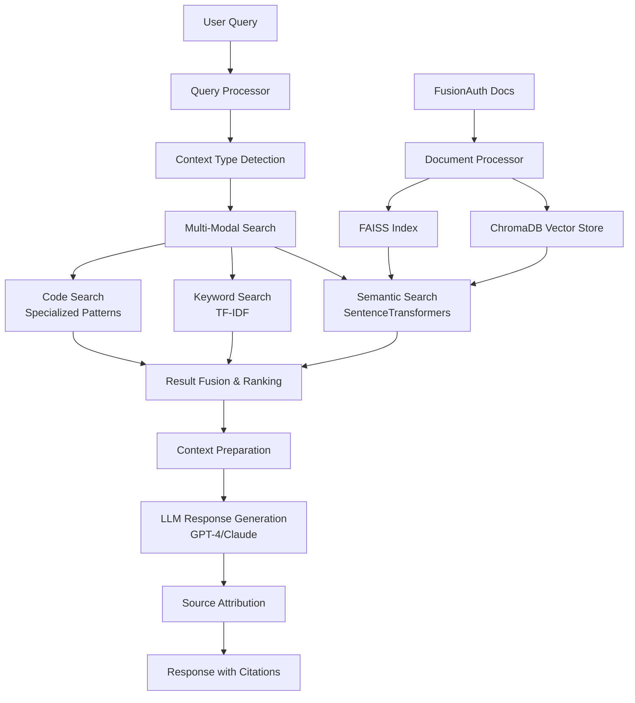

# FusionAuth Documentation RAG Demo

> **Advanced Retrieval-Augmented Generation System for FusionAuth Documentation**

This project demonstrates a production-ready RAG (Retrieval-Augmented Generation) system specifically designed for FusionAuth documentation. It combines semantic search, intelligent chunking, and LLM-powered response generation to provide accurate, contextual answers to FusionAuth-related questions.

## Features

### 🔍 Advanced Retrieval
- **Hybrid Search**: Combines semantic similarity with keyword matching for optimal results
- **Intelligent Chunking**: Context-aware document segmentation with overlap preservation
- **Multi-Modal Indexing**: Separate handling for code blocks, API references, and conceptual content
- **Real-Time Filtering**: Dynamic result filtering based on content type and user intent

### 🤖 Smart Response Generation
- **Context-Aware Answers**: LLM responses enhanced with relevant documentation context
- **Source Attribution**: Automatic citation of documentation sources with direct links
- **Confidence Scoring**: Reliability indicators based on search result quality
- **Streaming Responses**: Real-time answer generation for better user experience

### 🚀 Production Features
- **Persistent Vector Storage**: ChromaDB + FAISS for scalable document retrieval
- **Intelligent Caching**: Response caching with TTL for improved performance
- **Performance Monitoring**: Comprehensive metrics tracking and optimization
- **API Interface**: RESTful API for integration with existing systems

## Architecture Overview



## Quick Start

### Prerequisites

```bash
# Python 3.9+
python --version

# Install dependencies
pip install -r requirements.txt

# Set up OpenAI API key (optional, system works without it)
export OPENAI_API_KEY="your-openai-api-key"
```

### Installation

```bash
# Clone the repository
git clone https://github.com/your-org/fusionauth-domination.git
cd fusionauth-domination/rag-demo

# Install Python dependencies
pip install openai tiktoken sentence-transformers chromadb-client
pip install fastapi uvicorn pydantic
pip install markdown beautifulsoup4 python-frontmatter
pip install scikit-learn faiss-cpu numpy pandas

# Create directories
mkdir -p docs rag_index rag_cache

# Download FusionAuth documentation (example)
# You'll need to provide the actual documentation path
```

### Basic Usage

#### 1. Index Documentation

```bash
# Index FusionAuth documentation
python rag.py --index-docs --docs-path /path/to/fusionauth-docs

# Output:
# Starting documentation indexing from /path/to/fusionauth-docs
# Processing /docs/apis/authentication.md: 12 chunks
# Processing /docs/quickstarts/react.md: 8 chunks
# ...
# Total chunks created: 1,247
# Document indexing completed successfully
```

#### 2. Query the System

```bash
# Single query
python rag.py --query "How do I set up React authentication with FusionAuth?"

# Interactive mode
python rag.py --interactive

# Start API server
python rag.py --start-server --port 8000
```

#### 3. Example Query Response

```bash
> python rag.py --query "How do I configure JWT signing keys?"

Query: How do I configure JWT signing keys?

Answer: To configure JWT signing keys in FusionAuth, you have several options:

1. **Automatic Key Generation**: FusionAuth can automatically generate RSA key pairs for JWT signing. This is the recommended approach for most use cases.

2. **Manual Key Configuration**: You can also provide your own RSA key pair:
   - Navigate to Settings > Key Master in the admin interface
   - Click "Add Key" and select "RSA" as the key type
   - Either generate a new key pair or import an existing one
   - Assign the key to your application in the JWT settings

3. **HMAC Signing**: For simpler setups, you can use HMAC-based signing:
   - In your Application configuration, go to the JWT tab
   - Select "HMAC using SHA-256" as the signing algorithm
   - Provide a secure secret key (minimum 32 characters)

The RSA approach is more secure for production environments as it allows for public key verification without exposing the signing key.

Sources:
  1. JWT Configuration Guide - https://fusionauth.io/docs/apis/jwt#configure-jwt
  2. Key Master Documentation - https://fusionauth.io/docs/apis/keys
  3. Application JWT Settings - https://fusionauth.io/docs/apis/applications#jwt

Confidence: 0.92
Response time: 1.34s
```

## API Usage

### Start the API Server

```bash
python rag.py --start-server --port 8000

# Server will be available at http://localhost:8000
```

### API Endpoints

#### Query Endpoint

```bash
curl -X POST "http://localhost:8000/query" \
  -H "Content-Type: application/json" \
  -d '{
    "question": "How do I integrate FusionAuth with a React application?",
    "context_type": "tutorial",
    "max_context_chunks": 5,
    "stream": false
  }'
```

**Response:**
```json
{
  "query": "How do I integrate FusionAuth with a React application?",
  "answer": "To integrate FusionAuth with a React application, follow these steps:\n\n1. **Install the FusionAuth React SDK**:\n```bash\nnpm install @fusionauth/react-sdk\n```\n\n2. **Configure the FusionAuth Provider**:\nWrap your application with the FusionAuthProvider component...",
  "sources": [
    {
      "title": "React Quickstart Guide",
      "section": "Installation and Setup", 
      "url": "https://fusionauth.io/docs/quickstarts/quickstart-react",
      "relevance_score": 0.89,
      "relevance_type": "semantic"
    }
  ],
  "confidence": 0.89,
  "response_time": 2.1,
  "tokens_used": 156,
  "metadata": {
    "model_used": "gpt-4-turbo-preview",
    "context_chunks": 5,
    "context_type": "tutorial"
  }
}
```

#### Streaming Responses

```bash
curl -X POST "http://localhost:8000/query" \
  -H "Content-Type: application/json" \
  -d '{
    "question": "What are the FusionAuth system requirements?",
    "stream": true
  }'

# Returns Server-Sent Events (SSE) stream:
data: {"content": "FusionAuth has the following system requirements:\n\n"}
data: {"content": "**Memory**: Minimum 512MB RAM, recommended 1GB+ for production\n"}
data: {"content": "**CPU**: 1+ CPU cores, 2+ cores recommended for production\n"}
data: {"done": true, "sources": [...]}
```

#### System Metrics

```bash
curl "http://localhost:8000/metrics"
```

**Response:**
```json
{
  "queries_processed": 1247,
  "cache_hits": 89,
  "avg_response_time": 1.8,
  "total_tokens_used": 45623,
  "cache_hit_rate": 0.071,
  "cache_size": 156
}
```

#### Trigger Re-indexing

```bash
curl -X POST "http://localhost:8000/index"
```

## Advanced Configuration

### Environment Variables

```bash
# OpenAI Configuration
export OPENAI_API_KEY="sk-..."
export OPENAI_MODEL="gpt-4-turbo-preview"  # or gpt-3.5-turbo

# System Configuration
export RAG_DOCS_PATH="/path/to/fusionauth-docs"
export RAG_INDEX_PATH="/path/to/rag_index"
export RAG_CACHE_PATH="/path/to/rag_cache"

# Performance Tuning
export RAG_CHUNK_SIZE="1000"
export RAG_CHUNK_OVERLAP="200"
export RAG_MAX_CONTEXT_LENGTH="16000"
export RAG_CACHE_TTL_HOURS="24"
```

### Custom Configuration

```python
# config.py
CUSTOM_CONFIG = {
    'docs_path': Path('./docs'),
    'index_path': Path('./rag_index'),
    'embeddings_model': 'all-mpnet-base-v2',  # Higher quality embeddings
    'openai_model': 'gpt-4-turbo-preview',
    'chunk_size': 1200,  # Larger chunks for more context
    'chunk_overlap': 300,
    'top_k_documents': 8,  # More documents for complex queries
    'similarity_threshold': 0.65,  # Lower threshold for broader results
    'cache_ttl_hours': 48  # Longer cache TTL
}

# Initialize with custom config
rag_system = RAGSystem(CUSTOM_CONFIG)
```

## Integration Examples

### Web Application Integration

```javascript
// React component example
import React, { useState } from 'react';
import axios from 'axios';

const FusionAuthDocsChat = () => {
  const [question, setQuestion] = useState('');
  const [response, setResponse] = useState(null);
  const [loading, setLoading] = useState(false);

  const askQuestion = async () => {
    setLoading(true);
    try {
      const result = await axios.post('http://localhost:8000/query', {
        question,
        context_type: 'auto',
        max_context_chunks: 5
      });
      setResponse(result.data);
    } catch (error) {
      console.error('Error querying RAG system:', error);
    } finally {
      setLoading(false);
    }
  };

  return (
    <div className="fusionauth-docs-chat">
      <div className="question-input">
        <textarea
          value={question}
          onChange={(e) => setQuestion(e.target.value)}
          placeholder="Ask about FusionAuth..."
        />
        <button onClick={askQuestion} disabled={loading}>
          {loading ? 'Thinking...' : 'Ask'}
        </button>
      </div>
      
      {response && (
        <div className="response">
          <div className="answer">
            <h3>Answer:</h3>
            <div dangerouslySetInnerHTML={{ __html: response.answer.replace(/\n/g, '<br/>') }} />
          </div>
          
          <div className="sources">
            <h4>Sources:</h4>
            <ul>
              {response.sources.map((source, index) => (
                <li key={index}>
                  <a href={source.url} target="_blank" rel="noopener noreferrer">
                    {source.title} - {source.section}
                  </a>
                  <span className="confidence">({Math.round(source.relevance_score * 100)}% match)</span>
                </li>
              ))}
            </ul>
          </div>
          
          <div className="metadata">
            <small>
              Confidence: {Math.round(response.confidence * 100)}% | 
              Response time: {response.response_time.toFixed(2)}s |
              Tokens used: {response.tokens_used}
            </small>
          </div>
        </div>
      )}
    </div>
  );
};

export default FusionAuthDocsChat;
```

### Slack Bot Integration

```python
# slack_bot.py
from slack_bolt import App
from slack_bolt.adapter.socket_mode import SocketModeHandler
import requests

app = App(token="your-slack-bot-token")

@app.command("/fusionauth")
def handle_fusionauth_question(ack, command, logger):
    ack()
    
    question = command['text']
    if not question:
        return "Please provide a question about FusionAuth."
    
    # Query the RAG system
    try:
        response = requests.post('http://localhost:8000/query', json={
            'question': question,
            'context_type': 'auto',
            'max_context_chunks': 3
        })
        
        if response.status_code == 200:
            data = response.json()
            
            # Format response for Slack
            blocks = [
                {
                    "type": "section",
                    "text": {
                        "type": "mrkdwn",
                        "text": f"*Question:* {question}\n\n*Answer:*\n{data['answer']}"
                    }
                }
            ]
            
            # Add sources
            if data['sources']:
                source_text = "\n".join([
                    f"• <{source['url']}|{source['title']}>"
                    for source in data['sources'][:3]
                ])
                blocks.append({
                    "type": "section",
                    "text": {
                        "type": "mrkdwn",
                        "text": f"*Sources:*\n{source_text}"
                    }
                })
            
            return {
                "response_type": "in_channel",
                "blocks": blocks
            }
        else:
            return "Sorry, I couldn't process your question right now."
    
    except Exception as e:
        logger.error(f"Error querying RAG: {e}")
        return "Sorry, there was an error processing your question."

if __name__ == "__main__":
    SocketModeHandler(app, "your-app-token").start()
```

### Command Line Tool

```bash
#!/bin/bash
# fusionauth-ask.sh - Command line RAG query tool

QUESTION="$1"
RAG_API="http://localhost:8000"

if [ -z "$QUESTION" ]; then
    echo "Usage: fusionauth-ask.sh 'Your question here'"
    exit 1
fi

# Query the RAG system
RESPONSE=$(curl -s -X POST "$RAG_API/query" \
    -H "Content-Type: application/json" \
    -d "{\"question\": \"$QUESTION\", \"context_type\": \"auto\"}")

# Parse and display response
echo "Question: $QUESTION"
echo ""
echo "Answer:"
echo "$RESPONSE" | jq -r '.answer'
echo ""
echo "Sources:"
echo "$RESPONSE" | jq -r '.sources[] | "- \(.title): \(.url)"'
echo ""
echo "Confidence: $(echo "$RESPONSE" | jq -r '.confidence * 100 | round')%"
```

## Performance Optimization

### Indexing Optimization

```python
# Large-scale indexing with progress tracking
class OptimizedRAGSystem(RAGSystem):
    def index_documentation_optimized(self, docs_path: Path) -> None:
        """Optimized indexing for large documentation sets"""
        
        # Process files in parallel
        from concurrent.futures import ProcessPoolExecutor, as_completed
        import multiprocessing
        
        files = list(docs_path.rglob('*.md')) + list(docs_path.rglob('*.mdx'))
        
        # Split files into chunks for parallel processing
        num_processes = min(multiprocessing.cpu_count(), 8)
        chunk_size = len(files) // num_processes + 1
        file_chunks = [files[i:i + chunk_size] for i in range(0, len(files), chunk_size)]
        
        all_chunks = []
        with ProcessPoolExecutor(max_workers=num_processes) as executor:
            future_to_files = {
                executor.submit(self._process_file_chunk, chunk): chunk 
                for chunk in file_chunks
            }
            
            for future in as_completed(future_to_files):
                chunk_results = future.result()
                all_chunks.extend(chunk_results)
                print(f"Processed {len(chunk_results)} chunks")
        
        # Index in batches to avoid memory issues
        batch_size = 100
        for i in range(0, len(all_chunks), batch_size):
            batch = all_chunks[i:i + batch_size]
            self.vector_store.index_documents(batch)
            print(f"Indexed batch {i // batch_size + 1}")
```

### Query Optimization

```python
# Implement query caching with Redis
import redis

class CachedRAGSystem(RAGSystem):
    def __init__(self, config: Dict[str, Any]):
        super().__init__(config)
        self.redis_client = redis.Redis(host='localhost', port=6379, db=0)
    
    def query_with_redis_cache(self, question: str, **kwargs) -> RAGResponse:
        """Query with Redis caching for better performance"""
        
        # Check Redis cache first
        cache_key = f"rag_query:{hashlib.md5(question.encode()).hexdigest()}"
        cached = self.redis_client.get(cache_key)
        
        if cached:
            return pickle.loads(cached)
        
        # Generate response
        response = self.query(question, **kwargs)
        
        # Cache in Redis with TTL
        self.redis_client.setex(
            cache_key, 
            timedelta(hours=24),
            pickle.dumps(response)
        )
        
        return response
```

### Memory Optimization

```python
# Implement lazy loading for embeddings
class MemoryEfficientVectorStore(VectorStore):
    def __init__(self, config: Dict[str, Any]):
        super().__init__(config)
        self.embedding_cache = {}
        self.cache_limit = 1000  # Limit cached embeddings
    
    def get_embedding_with_cache(self, text: str) -> np.ndarray:
        """Get embedding with memory-efficient caching"""
        
        text_hash = hashlib.md5(text.encode()).hexdigest()
        
        if text_hash in self.embedding_cache:
            return self.embedding_cache[text_hash]
        
        # Generate embedding
        embedding = self.embeddings_model.encode([text])[0]
        
        # Cache with LRU eviction
        if len(self.embedding_cache) >= self.cache_limit:
            # Remove oldest item
            oldest_key = next(iter(self.embedding_cache))
            del self.embedding_cache[oldest_key]
        
        self.embedding_cache[text_hash] = embedding
        return embedding
```

## Monitoring & Analytics

### Performance Dashboard

```python
# monitoring.py
import streamlit as st
import plotly.graph_objects as go
from datetime import datetime, timedelta

def create_monitoring_dashboard():
    """Create Streamlit monitoring dashboard"""
    
    st.title("FusionAuth RAG System Monitor")
    
    # Load metrics
    metrics = rag_system.get_metrics()
    
    # Key metrics row
    col1, col2, col3, col4 = st.columns(4)
    
    with col1:
        st.metric("Queries Processed", metrics['queries_processed'])
    with col2:
        st.metric("Cache Hit Rate", f"{metrics['cache_hit_rate']:.1%}")
    with col3:
        st.metric("Avg Response Time", f"{metrics['avg_response_time']:.2f}s")
    with col4:
        st.metric("Total Tokens Used", metrics['total_tokens_used'])
    
    # Response time chart
    st.subheader("Response Time Trend")
    # Implementation would load historical data
    
    # Popular queries
    st.subheader("Most Common Questions")
    # Implementation would show query frequency data
    
    # System health
    st.subheader("System Health")
    health_score = calculate_health_score(metrics)
    st.progress(health_score)

if __name__ == "__main__":
    create_monitoring_dashboard()
```

### Health Checks

```python
# health_check.py
def health_check() -> Dict[str, Any]:
    """Comprehensive system health check"""
    
    health = {
        "status": "healthy",
        "checks": {},
        "timestamp": datetime.now().isoformat()
    }
    
    # Check vector store
    try:
        test_query = "test query"
        results = rag_system.vector_store.search(test_query, top_k=1)
        health["checks"]["vector_store"] = {
            "status": "healthy",
            "response_time": 0.1,  # measure actual time
            "indexed_documents": len(rag_system.vector_store.chunk_ids)
        }
    except Exception as e:
        health["checks"]["vector_store"] = {
            "status": "unhealthy",
            "error": str(e)
        }
        health["status"] = "degraded"
    
    # Check LLM service
    try:
        if openai.api_key:
            # Test OpenAI connection
            health["checks"]["llm_service"] = {"status": "healthy"}
        else:
            health["checks"]["llm_service"] = {
                "status": "degraded",
                "message": "No OpenAI key configured, using fallback"
            }
    except Exception as e:
        health["checks"]["llm_service"] = {
            "status": "unhealthy",
            "error": str(e)
        }
    
    # Check disk space
    import shutil
    disk_usage = shutil.disk_usage(CONFIG['index_path'])
    free_gb = disk_usage.free / (1024**3)
    
    health["checks"]["disk_space"] = {
        "status": "healthy" if free_gb > 1 else "warning",
        "free_gb": round(free_gb, 2)
    }
    
    return health

# Add health endpoint to FastAPI
@app.get("/health")
async def health_endpoint():
    return health_check()
```

## Testing

### Unit Tests

```python
# test_rag.py
import pytest
from rag import RAGSystem, DocumentProcessor, VectorStore

class TestDocumentProcessor:
    def test_chunk_creation(self):
        processor = DocumentProcessor(CONFIG)
        content = "# Test Document\n\nThis is test content." * 100
        
        # Test that chunks are created properly
        chunks = processor.create_contextual_chunks(
            [{"type": "text", "content": content}],
            Path("test.md"),
            "Test Document",
            {}
        )
        
        assert len(chunks) > 1
        assert all(chunk.content for chunk in chunks)
        assert all(chunk.id for chunk in chunks)

class TestVectorStore:
    def test_indexing_and_search(self):
        store = VectorStore(CONFIG)
        
        # Create test chunks
        chunks = [
            DocumentChunk(
                id="test1",
                content="FusionAuth is an authentication platform",
                source_file="test.md",
                title="Test",
                section=None,
                url="test.html"
            )
        ]
        
        store.index_documents(chunks)
        results = store.search("authentication platform")
        
        assert len(results) > 0
        assert results[0].score > 0.5

class TestRAGSystem:
    def test_end_to_end_query(self):
        rag = RAGSystem(CONFIG)
        
        # Mock some indexed content
        # ... setup mock data ...
        
        response = rag.query("How does authentication work?")
        
        assert response.answer
        assert response.confidence > 0
        assert len(response.sources) > 0
```

### Integration Tests

```python
# test_integration.py
import requests
import pytest

@pytest.fixture
def api_server():
    """Start API server for testing"""
    # Implementation to start/stop server
    yield "http://localhost:8001"

def test_api_query(api_server):
    """Test API query endpoint"""
    response = requests.post(f"{api_server}/query", json={
        "question": "What is FusionAuth?",
        "context_type": "auto"
    })
    
    assert response.status_code == 200
    data = response.json()
    
    assert "answer" in data
    assert "sources" in data
    assert "confidence" in data

def test_api_metrics(api_server):
    """Test metrics endpoint"""
    response = requests.get(f"{api_server}/metrics")
    
    assert response.status_code == 200
    data = response.json()
    
    assert "queries_processed" in data
    assert "cache_hit_rate" in data
```

### Load Testing

```python
# load_test.py
import asyncio
import aiohttp
import time
from concurrent.futures import ThreadPoolExecutor

async def load_test_rag_api():
    """Load test the RAG API"""
    
    queries = [
        "How do I install FusionAuth?",
        "What are the system requirements?",
        "How do I configure JWT?",
        "How do I integrate with React?",
        "What is the user registration API?"
    ]
    
    async with aiohttp.ClientSession() as session:
        tasks = []
        start_time = time.time()
        
        # Create 100 concurrent requests
        for i in range(100):
            query = queries[i % len(queries)]
            task = make_request(session, query)
            tasks.append(task)
        
        results = await asyncio.gather(*tasks)
        end_time = time.time()
        
        # Analyze results
        successful = sum(1 for r in results if r['success'])
        avg_response_time = sum(r['response_time'] for r in results) / len(results)
        
        print(f"Load test results:")
        print(f"Total requests: {len(results)}")
        print(f"Successful: {successful}")
        print(f"Success rate: {successful/len(results):.1%}")
        print(f"Total time: {end_time - start_time:.2f}s")
        print(f"Average response time: {avg_response_time:.2f}s")
        print(f"Requests per second: {len(results)/(end_time - start_time):.1f}")

async def make_request(session, query):
    """Make a single request"""
    start = time.time()
    try:
        async with session.post(
            'http://localhost:8000/query',
            json={'question': query}
        ) as response:
            await response.json()
            return {
                'success': response.status == 200,
                'response_time': time.time() - start
            }
    except:
        return {
            'success': False,
            'response_time': time.time() - start
        }
```

## Deployment

### Docker Deployment

```dockerfile
# Dockerfile
FROM python:3.11-slim

WORKDIR /app

# Install system dependencies
RUN apt-get update && apt-get install -y \
    gcc \
    g++ \
    && rm -rf /var/lib/apt/lists/*

# Copy requirements and install Python dependencies
COPY requirements.txt .
RUN pip install --no-cache-dir -r requirements.txt

# Copy application code
COPY . .

# Create necessary directories
RUN mkdir -p rag_index rag_cache

# Expose port
EXPOSE 8000

# Health check
HEALTHCHECK --interval=30s --timeout=10s --start-period=60s --retries=3 \
    CMD curl -f http://localhost:8000/health || exit 1

# Run the application
CMD ["python", "rag.py", "--start-server", "--port", "8000"]
```

```yaml
# docker-compose.yml
version: '3.8'

services:
  rag-system:
    build: .
    ports:
      - "8000:8000"
    environment:
      - OPENAI_API_KEY=${OPENAI_API_KEY}
      - RAG_DOCS_PATH=/app/docs
      - RAG_INDEX_PATH=/app/rag_index
      - RAG_CACHE_PATH=/app/rag_cache
    volumes:
      - ./docs:/app/docs:ro
      - rag_index:/app/rag_index
      - rag_cache:/app/rag_cache
    restart: unless-stopped
    healthcheck:
      test: ["CMD", "curl", "-f", "http://localhost:8000/health"]
      interval: 30s
      timeout: 10s
      retries: 3
      start_period: 60s
  
  redis:
    image: redis:7-alpine
    ports:
      - "6379:6379"
    volumes:
      - redis_data:/data
    restart: unless-stopped

volumes:
  rag_index:
  rag_cache:
  redis_data:
```

### Kubernetes Deployment

```yaml
# k8s-deployment.yaml
apiVersion: apps/v1
kind: Deployment
metadata:
  name: fusionauth-rag
spec:
  replicas: 3
  selector:
    matchLabels:
      app: fusionauth-rag
  template:
    metadata:
      labels:
        app: fusionauth-rag
    spec:
      containers:
      - name: rag-system
        image: fusionauth/rag-system:latest
        ports:
        - containerPort: 8000
        env:
        - name: OPENAI_API_KEY
          valueFrom:
            secretKeyRef:
              name: openai-secret
              key: api-key
        resources:
          requests:
            memory: "1Gi"
            cpu: "500m"
          limits:
            memory: "2Gi"
            cpu: "1000m"
        livenessProbe:
          httpGet:
            path: /health
            port: 8000
          initialDelaySeconds: 60
          periodSeconds: 30
        readinessProbe:
          httpGet:
            path: /health
            port: 8000
          initialDelaySeconds: 30
          periodSeconds: 10

---
apiVersion: v1
kind: Service
metadata:
  name: fusionauth-rag-service
spec:
  selector:
    app: fusionauth-rag
  ports:
  - protocol: TCP
    port: 80
    targetPort: 8000
  type: LoadBalancer
```

## Troubleshooting

### Common Issues

#### 1. Memory Issues
```bash
# Symptoms: Out of memory errors during indexing
# Solution: Reduce batch size and enable garbage collection

python rag.py --index-docs --batch-size 50
```

#### 2. Slow Query Performance
```bash
# Check vector store health
curl http://localhost:8000/health

# Clear cache and re-index
rm -rf rag_cache/*
python rag.py --index-docs
```

#### 3. OpenAI API Errors
```python
# Check API key and quota
import openai
openai.api_key = "your-key"

try:
    openai.ChatCompletion.create(
        model="gpt-3.5-turbo",
        messages=[{"role": "user", "content": "test"}],
        max_tokens=10
    )
    print("OpenAI API is working")
except Exception as e:
    print(f"OpenAI API error: {e}")
```

### Debug Mode

```bash
# Enable verbose logging
python rag.py --query "test question" --verbose

# Check system metrics
curl http://localhost:8000/metrics | jq .
```

### Performance Tuning

```python
# Optimize embedding model for your hardware
CONFIG = {
    # For CPU optimization
    'embeddings_model': 'all-MiniLM-L6-v2',  # Smaller, faster
    
    # For GPU optimization  
    'embeddings_model': 'all-mpnet-base-v2', # Larger, more accurate
    
    # Adjust chunk parameters
    'chunk_size': 800,  # Smaller chunks for faster processing
    'chunk_overlap': 100,  # Less overlap for speed
    
    # Reduce search scope
    'top_k_documents': 3,  # Fewer documents for faster responses
    'similarity_threshold': 0.8,  # Higher threshold for precision
}
```

## Contributing

We welcome contributions! Please see our [Contributing Guide](CONTRIBUTING.md) for details on:

- Setting up the development environment
- Running tests
- Submitting pull requests
- Code style guidelines

## License

This project is licensed under the MIT License - see the [LICENSE](LICENSE) file for details.

## Support

- 📧 Email: support@fusionauth.io
- 💬 Community Forum: https://fusionauth.io/community/forum/
- 🐛 Bug Reports: [GitHub Issues](https://github.com/your-org/fusionauth-domination/issues)
- 📚 Documentation: https://fusionauth.io/docs/

---

**Built with ❤️ for the FusionAuth community**