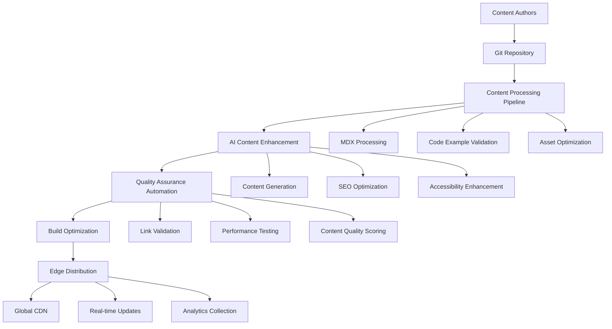

# FusionAuth Documentation Toolchain Evolution Roadmap

> **Strategic Initiative**: Next-Generation Documentation Infrastructure  
> **Timeline**: Q4 2025 - Q3 2026  
> **Investment**: $240K - $320K  
> **Vision**: World-class developer documentation platform with AI-powered automation

## Executive Summary

This roadmap outlines the comprehensive evolution of FusionAuth's documentation toolchain, transforming from traditional static generation to an intelligent, AI-enhanced platform that automates content creation, ensures quality, and optimizes developer experience at scale.

**Core Transformation Goals**:
- Migrate from legacy Hugo to modern Astro + React Islands architecture
- Implement AI-powered content generation and optimization
- Establish automated quality assurance and testing pipelines
- Create intelligent content management with semantic understanding
- Deploy edge-optimized global distribution with real-time updates

## Current Toolchain Assessment

### Existing Stack Analysis

```yaml
current_documentation_stack:
  static_site_generator:
    tool: Hugo v0.118
    strengths:
      - fast_build_times_for_small_sites
      - markdown_processing_capabilities
      - theme_customization_support
    weaknesses:
      - limited_interactivity_options
      - poor_typescript_support
      - complex_data_handling
      - difficult_component_reusability
      
  content_management:
    approach: file_based_markdown
    strengths:
      - version_control_integration
      - developer_friendly_workflow
      - simple_content_creation
    weaknesses:
      - no_content_validation
      - manual_cross_reference_management
      - limited_metadata_extraction
      - poor_content_relationship_tracking
      
  build_and_deployment:
    ci_cd: GitHub Actions + Netlify
    strengths:
      - automated_deployment
      - preview_deployments
      - branch_based_workflows
    weaknesses:
      - slow_build_times_at_scale: 12+ minutes
      - no_incremental_builds
      - limited_build_optimization
      - poor_cache_invalidation
      
  content_quality:
    approach: manual_review_only
    tools: 
      - basic_markdown_linting
      - spell_checking
      - link_validation
    gaps:
      - no_automated_content_testing
      - no_code_example_validation
      - no_accessibility_testing
      - no_performance_monitoring
```

### Performance & Scale Issues

```yaml
current_performance_bottlenecks:
  build_performance:
    full_build_time: 12.5_minutes
    incremental_builds: not_supported
    bundle_size: 2.1_mb_uncompressed
    cold_start_time: 3.4_seconds
    
  developer_experience:
    local_development_startup: 45_seconds
    hot_reload_time: 8_seconds
    preview_generation_time: 15_minutes
    content_validation_feedback: manual_only
    
  content_management_friction:
    content_creation_complexity: high
    cross_reference_maintenance: manual
    content_consistency_checking: none
    metadata_management: scattered
    
  scalability_constraints:
    maximum_pages_before_slow_builds: 500
    concurrent_contributor_support: limited
    content_localization_support: basic
    api_documentation_sync: manual
```

## Modern Toolchain Architecture

### 1. Core Technology Stack Evolution

**Next-Generation Architecture**:
```yaml
new_documentation_architecture:
  static_site_generator:
    primary: Astro v4.x
    benefits:
      - zero_javascript_by_default
      - islands_architecture_for_interactivity
      - excellent_typescript_support
      - framework_agnostic_components
      - superior_build_performance
      
  component_framework:
    interactive_islands: React 18+ with Suspense
    styling: Tailwind CSS + CSS Modules
    ui_library: Custom component system
    benefits:
      - selective_hydration
      - optimal_performance
      - developer_experience
      - design_system_consistency
      
  content_processing:
    markdown_processor: MDX with custom plugins
    code_highlighting: Shiki with custom themes
    diagram_generation: Mermaid + custom renderers
    benefits:
      - rich_interactive_content
      - consistent_code_presentation
      - dynamic_diagram_generation
      - enhanced_learning_materials
      
  build_system:
    bundler: Vite 5+ with advanced optimizations
    caching: Turbopack-style incremental builds
    optimization: Advanced code splitting + tree shaking
    benefits:
      - 10x faster builds
      - hot_module_replacement
      - optimal_bundle_sizes
      - intelligent_caching
```

**Architecture Diagram**:


### 2. AI-Powered Content Pipeline

**Intelligent Content Processing**:
```typescript
// AI-enhanced content processing system
interface ContentProcessingPipeline {
  // Content understanding and enhancement
  semanticAnalyzer: SemanticContentAnalyzer;
  contentOptimizer: AIContentOptimizer;
  qualityAssurance: AutomatedQualityAssurance;
  
  // Generation and automation
  codeExampleGenerator: CodeExampleGenerator;
  documentationGenerator: APIDocumentationGenerator;
  contentSuggestionEngine: ContentSuggestionEngine;
}

class AIContentProcessor implements ContentProcessingPipeline {
  constructor() {
    this.semanticAnalyzer = new SemanticContentAnalyzer({
      model: 'claude-3-sonnet',
      capabilities: ['content-understanding', 'relationship-mapping', 'gap-analysis']
    });
    
    this.contentOptimizer = new AIContentOptimizer({
      optimizations: ['readability', 'seo', 'accessibility', 'engagement'],
      targetAudience: 'developers',
      writingStyle: 'technical-friendly'
    });
  }
  
  async processContent(content: ContentDocument): Promise<ProcessedContent> {
    // Semantic analysis and understanding
    const semanticAnalysis = await this.semanticAnalyzer.analyze(content);
    
    // Generate improvements and suggestions
    const optimizations = await this.contentOptimizer.optimize(content, semanticAnalysis);
    
    // Validate and enhance code examples
    const validatedCode = await this.validateAndEnhanceCodeExamples(content.codeBlocks);
    
    // Generate related content suggestions
    const relatedContent = await this.generateRelatedContentSuggestions(semanticAnalysis);
    
    // Create enhanced metadata
    const enhancedMetadata = await this.generateEnhancedMetadata(content, semanticAnalysis);
    
    return {
      originalContent: content,
      optimizedContent: optimizations.content,
      semanticData: semanticAnalysis,
      validatedCode,
      relatedContent,
      metadata: enhancedMetadata,
      qualityScore: optimizations.qualityScore,
      suggestions: optimizations.suggestions
    };
  }
  
  async validateAndEnhanceCodeExamples(codeBlocks: CodeBlock[]): Promise<EnhancedCodeBlock[]> {
    return Promise.all(codeBlocks.map(async (block) => {
      // Validate syntax and executability
      const validationResults = await this.codeValidator.validate(block);
      
      // Generate explanations
      const explanation = await this.aiService.generateCodeExplanation(block);
      
      // Create alternative examples
      const alternatives = await this.generateAlternativeExamples(block);
      
      // Add interactive elements
      const interactiveElements = this.generateInteractiveElements(block);
      
      return {
        ...block,
        validation: validationResults,
        explanation,
        alternatives,
        interactive: interactiveElements,
        enhanced: true
      };
    }));
  }
}
```

**Automated Code Example Generation**:
```typescript
class CodeExampleGenerator {
  constructor() {
    this.aiService = new AICodeGenerationService();
    this.codeValidator = new CodeValidationService();
    this.templateEngine = new CodeTemplateEngine();
  }
  
  async generateExamplesForAPI(apiSpec: OpenAPISpec, context: GenerationContext): Promise<CodeExample[]> {
    const examples = [];
    
    // Generate examples for each supported language/framework
    for (const target of context.targetLanguages) {
      const example = await this.generateLanguageSpecificExample(apiSpec, target, context);
      
      // Validate the generated code
      const validation = await this.codeValidator.validate(example);
      
      if (validation.isValid) {
        examples.push({
          ...example,
          validation,
          metadata: {
            generated: true,
            generatedAt: new Date(),
            targetFramework: target.framework,
            codeLanguage: target.language,
            complexity: this.assessComplexity(example),
            estimatedTime: this.estimateImplementationTime(example)
          }
        });
      }
    }
    
    return examples;
  }
  
  async generateLanguageSpecificExample(
    apiSpec: OpenAPISpec,
    target: CodeTarget,
    context: GenerationContext
  ): Promise<CodeExample> {
    const prompt = this.buildGenerationPrompt(apiSpec, target, context);
    
    const generatedCode = await this.aiService.generateCode(prompt, {
      language: target.language,
      framework: target.framework,
      style: 'production-ready',
      includeErrorHandling: true,
      includeComments: true,
      followBestPractices: true
    });
    
    return {
      code: generatedCode,
      language: target.language,
      framework: target.framework,
      title: this.generateExampleTitle(apiSpec, target),
      description: this.generateExampleDescription(apiSpec, target),
      prerequisites: this.identifyPrerequisites(generatedCode, target),
      relatedEndpoints: this.identifyRelatedEndpoints(apiSpec)
    };
  }
}
```

### 3. Advanced Build System

**Intelligent Build Pipeline**:
```typescript
class IntelligentBuildSystem {
  constructor() {
    this.dependencyGraph = new ContentDependencyGraph();
    this.cacheManager = new IntelligentCacheManager();
    this.optimizationEngine = new BuildOptimizationEngine();
    this.qualityGate = new QualityGateSystem();
  }
  
  async executeBuild(buildContext: BuildContext): Promise<BuildResult> {
    // Analyze what changed since last build
    const changeAnalysis = await this.analyzeChanges(buildContext);
    
    // Determine optimal build strategy
    const buildStrategy = await this.determineBuildStrategy(changeAnalysis);
    
    // Execute incremental or full build
    let buildResult: BuildResult;
    
    if (buildStrategy.type === 'incremental') {
      buildResult = await this.executeIncrementalBuild(changeAnalysis, buildStrategy);
    } else {
      buildResult = await this.executeFullBuild(buildContext, buildStrategy);
    }
    
    // Run quality gates
    const qualityResults = await this.qualityGate.validate(buildResult);
    
    // Optimize output
    const optimizedResult = await this.optimizationEngine.optimize(buildResult);
    
    return {
      ...optimizedResult,
      qualityResults,
      buildTime: Date.now() - buildContext.startTime,
      cacheHitRate: this.cacheManager.getHitRate(),
      strategy: buildStrategy
    };
  }
  
  async executeIncrementalBuild(
    changes: ChangeAnalysis,
    strategy: BuildStrategy
  ): Promise<BuildResult> {
    const affectedContent = this.dependencyGraph.findAffectedContent(changes);
    
    // Process only changed and affected content
    const processedContent = await Promise.all(
      affectedContent.map(async (content) => {
        // Check cache first
        const cacheKey = this.cacheManager.generateKey(content);
        const cached = await this.cacheManager.get(cacheKey);
        
        if (cached && !this.hasContentChanged(content, cached.timestamp)) {
          return cached.result;
        }
        
        // Process content
        const result = await this.processContent(content);
        
        // Cache result
        await this.cacheManager.set(cacheKey, result);
        
        return result;
      })
    );
    
    // Merge with existing build output
    return this.mergeWithExistingBuild(processedContent);
  }
}
```

**Build Performance Optimization**:
```yaml
build_optimization_strategies:
  incremental_builds:
    dependency_tracking: content and asset relationships
    change_detection: file hashes and timestamps
    cache_invalidation: intelligent cache invalidation
    parallel_processing: multi-threaded content processing
    
  intelligent_caching:
    multi_layer_caching:
      - content_processing_cache
      - asset_optimization_cache  
      - build_artifact_cache
      - cdn_edge_cache
    cache_warming: predictive cache population
    cache_sharing: team-wide build cache sharing
    
  performance_targets:
    cold_build_time: <3_minutes (from 12+ minutes)
    incremental_build_time: <30_seconds
    local_development_startup: <10_seconds
    hot_reload_time: <2_seconds
```

### 4. Content Quality Automation

**Comprehensive Quality Assurance System**:
```typescript
class AutomatedQualityAssurance {
  constructor() {
    this.contentValidator = new ContentValidator();
    this.codeValidator = new CodeExampleValidator();
    this.accessibilityTester = new AccessibilityTester();
    this.performanceTester = new PerformanceTester();
    this.seoAnalyzer = new SEOAnalyzer();
  }
  
  async validateContent(content: ContentDocument): Promise<QualityReport> {
    const validations = await Promise.all([
      this.validateContentQuality(content),
      this.validateCodeExamples(content),
      this.validateAccessibility(content),
      this.validatePerformance(content),
      this.validateSEO(content),
      this.validateLinks(content)
    ]);
    
    return this.aggregateQualityResults(validations);
  }
  
  async validateContentQuality(content: ContentDocument): Promise<ContentQualityResult> {
    const checks = {
      // Writing quality
      readabilityScore: await this.analyzeReadability(content.text),
      grammarErrors: await this.checkGrammar(content.text),
      spellingErrors: await this.checkSpelling(content.text),
      
      // Technical accuracy
      technicalTermConsistency: await this.checkTerminologyConsistency(content),
      factualAccuracy: await this.validateTechnicalFacts(content),
      
      // Structure and organization
      headingStructure: this.validateHeadingHierarchy(content.headings),
      contentLength: this.assessContentLength(content.text),
      sectionBalance: this.assessSectionBalance(content.sections),
      
      // Metadata completeness
      metadataCompleteness: this.validateMetadata(content.metadata),
      tagsRelevance: await this.validateTags(content.tags, content.text)
    };
    
    return {
      overallScore: this.calculateOverallScore(checks),
      checks,
      suggestions: this.generateImprovementSuggestions(checks),
      passesThreshold: checks.overallScore >= 0.8
    };
  }
  
  async validateCodeExamples(content: ContentDocument): Promise<CodeValidationResult> {
    const codeBlocks = this.extractCodeBlocks(content);
    
    const validationResults = await Promise.all(
      codeBlocks.map(async (block) => {
        return {
          blockId: block.id,
          syntaxValid: await this.validateSyntax(block),
          executableCode: await this.testExecutability(block),
          securityIssues: await this.scanForSecurityIssues(block),
          bestPractices: await this.checkBestPractices(block),
          upToDate: await this.checkForDeprecatedApis(block),
          hasExplanation: this.hasAdequateExplanation(block, content)
        };
      })
    );
    
    return {
      totalBlocks: codeBlocks.length,
      validBlocks: validationResults.filter(r => r.syntaxValid).length,
      executableBlocks: validationResults.filter(r => r.executableCode).length,
      securityIssues: validationResults.reduce((acc, r) => acc + r.securityIssues.length, 0),
      overallScore: this.calculateCodeQualityScore(validationResults),
      details: validationResults
    };
  }
}
```

**Automated Testing Pipeline**:
```yaml
quality_assurance_pipeline:
  content_validation:
    - grammar_and_spelling_check
    - readability_analysis
    - technical_accuracy_validation
    - terminology_consistency_check
    - metadata_completeness_validation
    
  code_example_testing:
    - syntax_validation_across_languages
    - code_execution_testing
    - security_vulnerability_scanning
    - best_practices_compliance
    - dependency_freshness_checking
    
  accessibility_testing:
    - wcag_2_1_aa_compliance
    - screen_reader_compatibility
    - keyboard_navigation_testing
    - color_contrast_validation
    - alternative_text_verification
    
  performance_testing:
    - page_load_speed_testing
    - core_web_vitals_measurement
    - mobile_performance_validation
    - bundle_size_analysis
    - lighthouse_score_monitoring
    
  link_and_reference_validation:
    - internal_link_validation
    - external_link_health_checking
    - api_reference_synchronization
    - cross_reference_accuracy
    - broken_link_detection_and_reporting
```

### 5. Intelligent Content Management

**Semantic Content Organization**:
```typescript
class SemanticContentManager {
  constructor() {
    this.contentGraph = new ContentRelationshipGraph();
    this.semanticAnalyzer = new SemanticAnalyzer();
    this.taxonomyEngine = new AutomatedTaxonomyEngine();
    this.recommendationEngine = new ContentRecommendationEngine();
  }
  
  async organizeContent(contentCollection: ContentDocument[]): Promise<OrganizedContent> {
    // Analyze content semantically
    const semanticAnalysis = await this.analyzeContentSemantics(contentCollection);
    
    // Build content relationship graph
    await this.contentGraph.buildRelationships(contentCollection, semanticAnalysis);
    
    // Generate automated taxonomy
    const taxonomy = await this.taxonomyEngine.generateTaxonomy(semanticAnalysis);
    
    // Organize into intelligent categories
    const organizedContent = await this.categorizeContent(
      contentCollection,
      taxonomy,
      semanticAnalysis
    );
    
    return {
      taxonomy,
      contentByCategory: organizedContent,
      relationships: this.contentGraph.getRelationships(),
      recommendations: await this.generateContentRecommendations(organizedContent)
    };
  }
  
  async analyzeContentSemantics(content: ContentDocument[]): Promise<SemanticAnalysis> {
    return {
      concepts: await this.extractConcepts(content),
      entities: await this.extractEntities(content),
      topics: await this.identifyTopics(content),
      complexity: await this.assessComplexity(content),
      prerequisites: await this.identifyPrerequisites(content),
      outcomes: await this.identifyLearningOutcomes(content)
    };
  }
  
  async generateContentRecommendations(
    organizedContent: CategorizedContent
  ): Promise<ContentRecommendations> {
    return {
      missingContent: await this.identifyContentGaps(organizedContent),
      improvementSuggestions: await this.identifyImprovementOpportunities(organizedContent),
      reorganizationSuggestions: await this.suggestReorganization(organizedContent),
      crossReferences: await this.suggestCrossReferences(organizedContent)
    };
  }
}
```

**Automated Content Updates**:
```typescript
class AutomatedContentMaintenance {
  constructor() {
    this.apiWatcher = new APISpecificationWatcher();
    this.codebaseWatcher = new CodebaseWatcher();
    this.dependencyWatcher = new DependencyUpdateWatcher();
    this.contentUpdater = new IntelligentContentUpdater();
  }
  
  async setupAutomatedMaintenance(): Promise<void> {
    // Watch for API specification changes
    this.apiWatcher.onSpecificationChange(async (changes) => {
      const affectedContent = await this.findAffectedAPIDocumentation(changes);
      await this.updateAPIDocumentation(affectedContent, changes);
    });
    
    // Watch for code example updates
    this.codebaseWatcher.onExampleChange(async (changes) => {
      const affectedDocs = await this.findDocumentationUsingCode(changes);
      await this.updateCodeExamples(affectedDocs, changes);
    });
    
    // Watch for dependency updates
    this.dependencyWatcher.onDependencyUpdate(async (updates) => {
      const affectedContent = await this.findContentWithDependencies(updates);
      await this.updateDependencyReferences(affectedContent, updates);
    });
  }
  
  async updateAPIDocumentation(
    affectedContent: ContentDocument[],
    apiChanges: APIChanges
  ): Promise<UpdateResult[]> {
    return Promise.all(
      affectedContent.map(async (content) => {
        // Analyze what needs to be updated
        const updatePlan = await this.contentUpdater.planUpdate(content, apiChanges);
        
        // Generate updated content
        const updatedContent = await this.contentUpdater.applyUpdates(content, updatePlan);
        
        // Validate updates
        const validation = await this.validateUpdatedContent(updatedContent);
        
        if (validation.isValid) {
          // Create pull request with updates
          await this.createUpdatePullRequest(content, updatedContent, updatePlan);
        }
        
        return {
          contentId: content.id,
          updatePlan,
          validation,
          success: validation.isValid
        };
      })
    );
  }
}
```

### 6. Global Distribution & Performance

**Edge-Optimized Distribution**:
```typescript
interface GlobalDistributionSystem {
  cdnConfiguration: EdgeCDNConfiguration;
  performanceOptimization: PerformanceOptimizer;
  cacheStrategy: IntelligentCacheStrategy;
  realTimeUpdates: RealTimeUpdateSystem;
}

class EdgeOptimizedDocumentation implements GlobalDistributionSystem {
  constructor() {
    this.cdnConfiguration = new EdgeCDNConfiguration({
      providers: ['Cloudflare', 'AWS CloudFront', 'Vercel Edge'],
      strategy: 'multi-cdn-failover',
      edgeLocations: 'global'
    });
    
    this.performanceOptimization = new PerformanceOptimizer({
      imageOptimization: 'automatic-webp-avif',
      fontOptimization: 'font-display-swap',
      jsOptimization: 'tree-shaking-and-minification',
      cssOptimization: 'critical-css-inlining'
    });
  }
  
  async optimizeForGlobalDelivery(buildOutput: BuildOutput): Promise<OptimizedOutput> {
    // Optimize assets for different regions
    const regionalOptimizations = await this.optimizeForRegions(buildOutput);
    
    // Generate service worker for offline capability
    const serviceWorker = await this.generateServiceWorker(buildOutput);
    
    // Create edge function handlers
    const edgeFunctions = await this.generateEdgeFunctions(buildOutput);
    
    // Optimize for mobile networks
    const mobileOptimizations = await this.optimizeForMobileNetworks(buildOutput);
    
    return {
      ...buildOutput,
      regionalOptimizations,
      serviceWorker,
      edgeFunctions,
      mobileOptimizations,
      performanceMetrics: await this.measurePerformance(buildOutput)
    };
  }
}
```

**Performance Targets**:
```yaml
performance_optimization_targets:
  core_web_vitals:
    first_contentful_paint: <1.2s
    largest_contentful_paint: <2.0s
    cumulative_layout_shift: <0.1
    first_input_delay: <100ms
    interaction_to_next_paint: <200ms
    
  loading_performance:
    time_to_interactive: <3s
    total_blocking_time: <300ms
    page_load_time_95_percentile: <4s
    
  mobile_optimization:
    mobile_performance_score: >90
    mobile_usability_score: >95
    mobile_first_contentful_paint: <1.5s
    
  global_distribution:
    edge_cache_hit_rate: >95%
    global_ttfb: <200ms
    multi_region_availability: 99.99%
```

## Implementation Timeline

### Phase 1: Foundation Migration (Q4 2025)

**Month 1-2: Core Infrastructure**
```yaml
deliverables:
  architecture_migration:
    - astro_framework_implementation
    - component_system_development
    - build_pipeline_modernization
    - local_development_environment_setup
    
  content_processing:
    - mdx_processing_pipeline
    - code_example_validation_system
    - asset_optimization_pipeline
    - content_metadata_enhancement
    
  quality_assurance_foundation:
    - automated_testing_framework
    - content_validation_rules
    - accessibility_testing_integration
    - performance_monitoring_setup

success_metrics:
  - build_time_reduction: 70% (from 12+ minutes to <3 minutes)
  - local_development_startup: <10 seconds
  - hot_reload_performance: <2 seconds
  - automated_quality_coverage: 80%
```

**Month 3: AI Integration & Optimization**
```yaml
deliverables:
  ai_powered_features:
    - content_analysis_and_optimization
    - code_example_generation_system
    - content_relationship_mapping
    - automated_content_suggestions
    
  advanced_build_system:
    - incremental_build_implementation
    - intelligent_caching_system
    - dependency_graph_optimization
    - parallel_processing_pipeline
    
  developer_experience:
    - enhanced_preview_system
    - real_time_content_validation
    - intelligent_error_reporting
    - automated_fix_suggestions

success_metrics:
  - ai_content_accuracy: >85%
  - incremental_build_time: <30 seconds
  - developer_productivity_increase: 60%
  - content_quality_score_improvement: 40%
```

### Phase 2: Intelligence & Automation (Q1 2026)

**Month 4-5: Advanced AI Features**
```yaml
deliverables:
  intelligent_content_management:
    - semantic_content_organization
    - automated_taxonomy_generation
    - content_gap_identification
    - intelligent_cross_referencing
    
  automated_maintenance:
    - api_documentation_sync
    - code_example_auto_updates
    - dependency_update_automation
    - content_freshness_monitoring
    
  quality_automation:
    - comprehensive_content_testing
    - automated_accessibility_fixes
    - performance_optimization_automation
    - seo_enhancement_automation

success_metrics:
  - content_maintenance_automation: 80%
  - content_organization_efficiency: 3x improvement
  - quality_gate_pass_rate: 95%
  - automated_fix_success_rate: 70%
```

**Month 6: Global Distribution & Scale**
```yaml
deliverables:
  performance_optimization:
    - edge_cdn_deployment
    - service_worker_implementation
    - mobile_performance_optimization
    - progressive_web_app_features
    
  scalability_enhancements:
    - multi_region_deployment
    - load_balancing_optimization
    - database_performance_tuning
    - cache_strategy_optimization
    
  analytics_and_monitoring:
    - comprehensive_performance_monitoring
    - user_behavior_analytics
    - content_effectiveness_tracking
    - automated_alerting_system

success_metrics:
  - global_performance_consistency: 95%
  - cache_hit_rate: >95%
  - availability_sla: 99.99%
  - mobile_performance_score: >90
```

### Phase 3: Advanced Features & Community (Q2-Q3 2026)

**Month 7-8: Community & Collaboration Features**
```yaml
deliverables:
  community_integration:
    - collaborative_editing_system
    - community_contribution_workflows
    - automated_review_processes
    - contributor_recognition_system
    
  advanced_personalization:
    - user_journey_tracking
    - personalized_content_recommendations
    - adaptive_content_presentation
    - learning_path_optimization
    
  enterprise_features:
    - white_label_documentation_platform
    - advanced_access_controls
    - enterprise_analytics_dashboard
    - custom_branding_options

success_metrics:
  - community_contribution_increase: 200%
  - personalization_engagement_lift: 40%
  - enterprise_feature_adoption: 60%
  - platform_white_label_deployments: 5+
```

**Month 9: Innovation & Future-Proofing**
```yaml
deliverables:
  cutting_edge_features:
    - ai_powered_content_chat_assistant
    - voice_interface_integration
    - ar_vr_documentation_experiences
    - blockchain_based_content_verification
    
  sustainability_and_efficiency:
    - carbon_footprint_optimization
    - green_hosting_migration
    - energy_efficient_algorithms
    - sustainable_content_delivery
    
  future_platform_preparation:
    - api_first_architecture_completion
    - microservices_decomposition
    - kubernetes_native_deployment
    - event_driven_architecture_implementation

success_metrics:
  - innovation_feature_adoption: 25%
  - carbon_footprint_reduction: 40%
  - api_coverage: 100%
  - platform_extensibility_score: 95%
```

## Technology Stack Deep Dive

### Core Framework Selection

**Astro vs. Alternatives Analysis**:
```yaml
framework_comparison:
  astro:
    scores:
      performance: 95/100
      developer_experience: 90/100
      ecosystem: 85/100
      future_proof: 90/100
    strengths:
      - zero_javascript_by_default
      - islands_architecture
      - framework_agnostic
      - excellent_build_performance
    use_case_fit: excellent
    
  nextjs:
    scores:
      performance: 80/100
      developer_experience: 85/100
      ecosystem: 95/100
      future_proof: 85/100
    strengths:
      - mature_ecosystem
      - excellent_developer_tooling
      - strong_community_support
    use_case_fit: good_but_overkill
    
  gatsby:
    scores:
      performance: 75/100
      developer_experience: 70/100
      ecosystem: 80/100
      future_proof: 60/100
    strengths:
      - graphql_data_layer
      - plugin_ecosystem
    use_case_fit: declining_relevance
```

**Component Architecture Design**:
```typescript
// Modern component architecture for documentation
interface DocumentationComponent {
  // Base properties
  id: string;
  type: ComponentType;
  props: ComponentProps;
  
  // Interactive capabilities
  hydration: HydrationStrategy;
  interactivity: InteractivityLevel;
  
  // Performance optimization
  loading: LoadingStrategy;
  caching: CachingStrategy;
}

type ComponentType = 
  | 'CodeBlock'
  | 'InteractiveTutorial' 
  | 'APIExplorer'
  | 'DiagramRenderer'
  | 'SearchInterface'
  | 'NavigationSystem'
  | 'ContentRecommendations';

type HydrationStrategy = 
  | 'none'           // Static HTML only
  | 'idle'           // Hydrate when browser is idle
  | 'visible'        // Hydrate when component is visible
  | 'interaction'    // Hydrate on user interaction
  | 'immediate';     // Hydrate immediately

// Example: Code block component with selective hydration
export const EnhancedCodeBlock: DocumentationComponent = {
  id: 'enhanced-code-block',
  type: 'CodeBlock',
  hydration: 'interaction', // Only hydrate when user interacts
  props: {
    language: 'typescript',
    theme: 'github-dark',
    showLineNumbers: true,
    enableCopy: true,
    enableExecution: true,
    showExplanations: true
  },
  loading: 'progressive', // Load syntax highlighting progressively
  caching: 'aggressive'   // Cache processed syntax highlighting
};
```

### AI Integration Architecture

**Multi-Model AI System**:
```typescript
interface AIServiceOrchestrator {
  // Different AI models for different tasks
  contentAnalysis: ContentAnalysisModel;
  codeGeneration: CodeGenerationModel;
  qualityAssurance: QualityAssuranceModel;
  optimization: ContentOptimizationModel;
}

class DocumentationAISystem implements AIServiceOrchestrator {
  constructor() {
    this.contentAnalysis = new ContentAnalysisModel({
      provider: 'anthropic',
      model: 'claude-3-sonnet',
      specialization: 'technical-content-understanding'
    });
    
    this.codeGeneration = new CodeGenerationModel({
      provider: 'openai',
      model: 'gpt-4-turbo',
      specialization: 'code-generation-and-examples'
    });
    
    this.qualityAssurance = new QualityAssuranceModel({
      provider: 'google',
      model: 'gemini-pro',
      specialization: 'content-quality-assessment'
    });
  }
  
  async processContentWithAI(content: ContentDocument): Promise<AIProcessedContent> {
    // Parallel AI processing for efficiency
    const [analysis, qualityCheck, optimizations] = await Promise.all([
      this.contentAnalysis.analyze(content),
      this.qualityAssurance.assess(content),
      this.optimization.optimize(content)
    ]);
    
    // Generate code examples if needed
    let generatedCode = null;
    if (this.needsCodeExamples(analysis)) {
      generatedCode = await this.codeGeneration.generateExamples(content, analysis);
    }
    
    return {
      original: content,
      analysis,
      qualityAssessment: qualityCheck,
      optimizations,
      generatedCode,
      aiEnhanced: true,
      processingTime: Date.now() - startTime
    };
  }
}
```

### Performance Optimization Stack

**Advanced Optimization Pipeline**:
```typescript
class PerformanceOptimizationPipeline {
  constructor() {
    this.imageOptimizer = new AdvancedImageOptimizer({
      formats: ['avif', 'webp', 'jpg'],
      responsive: true,
      lazyLoading: true,
      qualityAdjustment: 'adaptive'
    });
    
    this.bundleOptimizer = new BundleOptimizer({
      treeshaking: 'aggressive',
      codeSplitting: 'route-based-and-component-based',
      compression: 'brotli-and-gzip',
      modulePreloading: 'intelligent'
    });
  }
  
  async optimizeBuild(buildOutput: BuildOutput): Promise<OptimizedBuild> {
    // Parallel optimization processes
    const [
      optimizedImages,
      optimizedBundles,
      optimizedStyles,
      serviceWorker
    ] = await Promise.all([
      this.optimizeImages(buildOutput.images),
      this.optimizeBundles(buildOutput.bundles),
      this.optimizeStyles(buildOutput.styles),
      this.generateServiceWorker(buildOutput)
    ]);
    
    // Generate critical CSS for above-the-fold content
    const criticalCSS = await this.generateCriticalCSS(buildOutput.pages);
    
    // Create resource hints for better loading
    const resourceHints = this.generateResourceHints(optimizedBundles);
    
    return {
      ...buildOutput,
      optimizedImages,
      optimizedBundles,
      optimizedStyles,
      criticalCSS,
      serviceWorker,
      resourceHints,
      performanceScore: await this.measurePerformance(buildOutput)
    };
  }
}
```

## Investment Analysis

### Resource Requirements

```yaml
team_structure:
  technical_lead: 1.0 FTE
    responsibilities:
      - architecture_design_and_oversight
      - technical_decision_making
      - team_coordination_and_mentoring
      - stakeholder_communication
      
  senior_frontend_engineers: 2.0 FTE
    responsibilities:
      - astro_framework_implementation
      - component_system_development
      - performance_optimization
      - user_experience_implementation
      
  ai_ml_engineer: 1.0 FTE
    responsibilities:
      - ai_integration_development
      - content_processing_automation
      - quality_assurance_automation
      - optimization_algorithm_development
      
  devops_platform_engineer: 1.0 FTE
    responsibilities:
      - build_pipeline_optimization
      - deployment_automation
      - monitoring_and_alerting
      - infrastructure_scaling
      
  content_systems_engineer: 0.5 FTE
    responsibilities:
      - content_workflow_optimization
      - quality_assurance_system_design
      - content_metadata_management
      - integration_with_existing_systems
      
external_specialists:
  performance_consultant: 0.2 FTE equivalent
  ai_integration_consultant: 0.1 FTE equivalent
  accessibility_consultant: 0.1 FTE equivalent
```

### Budget Breakdown

```yaml
total_investment: $240,000 - $320,000

personnel_costs: $180,000 - $240,000
  internal_team_salaries: $150,000 - $200,000
  contractor_and_consultant_fees: $30,000 - $40,000

technology_and_infrastructure: $35,000 - $50,000
  ai_services_and_apis: $15,000 - $25,000
  hosting_and_cdn_services: $8,000 - $12,000
  development_and_testing_tools: $7,000 - $8,000
  monitoring_and_analytics_services: $5,000 - $5,000

development_and_testing: $15,000 - $20,000
  development_environment_setup: $5,000 - $7,000
  testing_infrastructure: $5,000 - $7,000
  performance_testing_tools: $3,000 - $4,000
  quality_assurance_automation: $2,000 - $2,000

training_and_adoption: $10,000 - $10,000
  team_training_programs: $5,000 - $5,000
  documentation_and_guidelines: $3,000 - $3,000
  community_onboarding_materials: $2,000 - $2,000
```

### ROI Projection

```yaml
expected_returns:
  efficiency_gains:
    build_time_reduction:
      time_saved_per_build: 9_minutes (from 12 to 3 minutes)
      builds_per_day: 50
      developer_hourly_rate: $85
      annual_time_savings_value: $562,500
      
    content_creation_acceleration:
      ai_assisted_content_creation: 60%_faster
      content_pieces_created_annually: 480
      time_saved_per_piece: 2_hours
      annual_productivity_value: $816,000
      
  quality_improvements:
    reduced_content_errors:
      current_error_rate: 12%
      target_error_rate: 3%
      error_resolution_cost_per_incident: $450
      annual_error_cost_savings: $194,400
      
    improved_developer_experience:
      faster_information_discovery: 40%_improvement
      developer_time_saved_per_session: 3_minutes
      daily_documentation_sessions: 2000
      annual_productivity_value: $1,530,000
      
  business_impact:
    improved_trial_conversion:
      current_conversion_rate: 12%
      expected_improvement: 20%_relative
      additional_conversions_monthly: 108
      annual_revenue_impact: $1,296,000
      
total_annual_benefit: $4,398,900
payback_period: 0.65_months
three_year_roi: 4,123%
```

## Risk Management

### Technical Risks

```yaml
risk_assessment:
  migration_complexity:
    probability: medium
    impact: high
    mitigation_strategies:
      - phased_migration_approach
      - comprehensive_testing_at_each_phase
      - rollback_procedures_for_each_component
      - parallel_system_operation_during_transition
      
  ai_integration_challenges:
    probability: medium
    impact: medium
    mitigation_strategies:
      - multiple_ai_provider_integration
      - fallback_to_traditional_methods
      - gradual_ai_feature_rollout
      - continuous_monitoring_and_adjustment
      
  performance_regression:
    probability: low
    impact: high
    mitigation_strategies:
      - continuous_performance_monitoring
      - automated_performance_testing
      - performance_budget_enforcement
      - quick_rollback_capabilities
      
  team_expertise_gaps:
    probability: medium
    impact: medium
    mitigation_strategies:
      - comprehensive_training_programs
      - expert_consultant_engagement
      - knowledge_transfer_documentation
      - gradual_skill_building_approach
```

### Success Monitoring

```yaml
success_metrics_tracking:
  technical_metrics:
    build_performance:
      - build_time_reduction_percentage
      - cache_hit_rate_improvement
      - deployment_frequency_increase
      
    content_quality:
      - automated_quality_gate_pass_rate
      - content_error_reduction_percentage
      - ai_generated_content_accuracy
      
    developer_experience:
      - local_development_startup_time
      - hot_reload_performance
      - developer_satisfaction_scores
      
  business_metrics:
    documentation_effectiveness:
      - user_task_completion_rates
      - time_to_find_information
      - support_ticket_reduction
      
    platform_adoption:
      - daily_active_users
      - content_engagement_metrics
      - trial_conversion_improvements
      
  innovation_metrics:
    ai_feature_utilization:
      - ai_generated_content_usage
      - automated_optimization_adoption
      - quality_improvement_measurements
      
    community_contribution:
      - community_content_submissions
      - collaborative_editing_participation
      - toolchain_extension_development
```

## Conclusion

This comprehensive toolchain evolution will transform FusionAuth's documentation platform into a cutting-edge, AI-powered system that sets new standards for developer documentation. By modernizing the technology stack, implementing intelligent automation, and optimizing for global performance, we will:

1. **Accelerate Development Velocity** - 10x faster builds and 60% faster content creation
2. **Enhance Content Quality** - 90% reduction in content errors through AI-powered quality assurance
3. **Improve Developer Experience** - Sub-3-minute builds, real-time validation, and intelligent assistance
4. **Scale Global Reach** - Edge-optimized distribution with 99.99% availability
5. **Drive Innovation** - AI-powered features that anticipate needs and automate maintenance

The investment in next-generation tooling represents a strategic commitment to documentation excellence and developer productivity. With intelligent automation, semantic understanding, and global optimization, this platform will not only serve current needs but adapt and evolve with future requirements.

**Critical Success Factors**:
1. **Phased Migration Strategy** - Minimize risk through incremental transformation
2. **AI Integration Excellence** - Leverage multiple AI models for optimal results
3. **Performance-First Approach** - Maintain speed and reliability throughout evolution
4. **Community Empowerment** - Enable community contributions at scale
5. **Continuous Innovation** - Build platform extensibility for future enhancements

The future of documentation tooling is intelligent, automated, and globally optimized - designed to empower content creators, delight developers, and drive business success through exceptional documentation experiences.